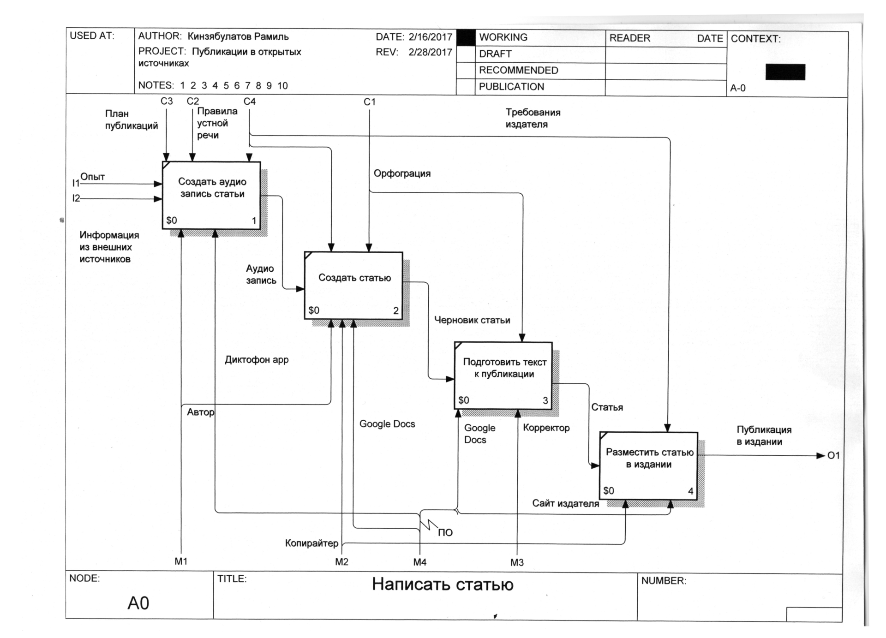

IDEF0
----

    “Одна картинка стоит тысячи слов.“

#### Народная мудрость

Зачастую в моей работе возникает необходимость не просто изучить и решить определенную проблему, но выявить ее местонахождение в общей модели работы компании. Мало понимать, что определенное подразделение работает неправильно, важно понимать, каким образом оно взаимодействует с другими. Иначе невозможно выявить все существующие проблемы и выбрать оптимальный метод решения поставленной задачи.

А для этого требуется изучить работу компании и составить ее функциональную модель.Конечно, в теории функциональная модель работы компании должна быть у руководителя, причем, не важно, идет речь об организации работы склада или об IT системе (от лида до заявки).

Но в реальности практически никогда ее не оказывается, а потому в процессе изучения и поиска решения поставленной клиентом задачи я также создаю функциональную модель работы компании или определенного процесса (функции) самостоятельно.

#### Несколько слов о преимуществах графики

Как известно, функциональные модели IDEF0 — это всегда графические схемы. У них есть свои особенности и правила составления. Об этом мы поговорим чуть-чуть позже. А сейчас я хотел бы привести пару примеров эффективности графики. Почему я делаю на этом акцент? Скорей всего, после моего утверждения о необходимости функциональной модели работы компании, очень многие подумали, что это все необязательно, можно и на словах пояснить как работает та или иная функция в компании. Вот об этом я и хочу поговорить.

И для начала сделаем небольшой экскурс в историю. Вернемся в далекий 1877 год, в период Русско-Турецкой войны. Именно тогда полиграфист Сытин впервые применил графику при описании военных действий. Сейчас для нас все это привычно, при описании любого сражения у каждого перед глазами возникают карты со стрелками, которые наглядно показывают ход сражения. А в те времена военные действия описывались словами. Для каждого боя — много-много слов. И понять в итоге, что же происходит, было очень сложно. А потому идея Сытина была поистине революционной — он начал печатать литографические копии карт с обозначением укреплений и расположений воинских частей. Назывались эти карты “Для читателей газет. Пособие”. Идея оказалась настолько актуальной, что первый же тираж “Пособий” разошелся мгновенно. И потом такие приложения были очень востребованы.

Причина очевидна. Графика помогала понять то, что при помощи одних слов разобрать было практически невозможно. Аналогичный пример беспомощности словесных описаний я могу привести также из своей практики. Один из моих заказчиков очень просил взяться за внедрение ERM-системы для его компании.

На вопрос, есть ли у них какое-то техническое задание, я получил ответ: “Да, есть. Но в нем 400 страниц”. При этом клиент очень жаловался, что мои коллеги, к которым он обращался ранее, либо отказывались от проекта вообще, либо называли явно завышенные цены.
После того, как я увидел, что в техническом задании действительно 400 страниц, и состоит оно исключительно из текстового описания, я понял причины поведения разработчиков. Прочитать такой объем текста, вникнуть в него, разобраться во всех нюансах только для того, чтобы понять задачу и назвать цену — это и правда очень сложно.

Этому клиенту я предложил альтернативный вариант — описать все, что можно, графически в виде нотаций. Показал ему примеры моделирования. В итоге они сейчас переосмысливают свои пожелания и оформление технического задания. Знаю я также много других примеров, когда графическое моделирование бизнес-процессов помогало в работе как моим коллегам, бизнес-консультантам и разработчикам, так и самим бизнесменам.

#### Почему это важно для моей работы

Моя работа всегда связана с внесением изменений в существующую КИС. А для того, чтобы внести изменения и получить нужный результат, нужно изучить то, что существует уже сейчас. И не важно, что именно мы делаем – настраиваем или устанавливаем с нуля CRM-систему, создаем эффективную ERP-систему, занимаемся интеграцией различных систем для повышения автоматизации работы в целом. В любом случае, для начала, необходимо получить представление о существующей схеме работы, и только после этого можно предлагать какие-то изменения и продумывать варианты решения поставленной задачи.

После изучения существующего положения вещей я, как и любой другой сторонний специалист, создаю коммерческое предложение, в котором максимально подробно раскрываю мое видение текущей ситуации, а также действия, которые необходимо выполнить для решения поставленной задачи, и, конечно, ожидаемый результат. Такие отчеты об обследовании работы получаются объемные, занимают не одну страницу, что с одной стороны, необходимо, а с другой – усложняет восприятие. Вначале я, как и многие, думал, что объемные отчеты — это хорошо, ведь человек платит за работу и нужно ему предоставить максимум подробной информации.

На самом деле, важно не предоставить объем, а максимально быстро и полно донести суть. Большие объемы текста требуют времени, которого у руководителей чаще всего очень мало. А графика позволяет сократить объем моего предложения и наглядно, в понятной форме показать решение. В результате мои предложения значительно сократились, в них появилась графика, а решения о начале сотрудничества стали приниматься быстрее. Именно по этой причине я использую наглядные модели.

Как известно, одна картинка стоит тысячи слов. И в случае описания бизнес-процессов и вариантов модернизации работы бизнеса – это действительно так. И здесь очень хорошо подходят нотации IDEF0.

Но для начала, давайте разберемся с основными понятиями, что такое нотации, зачем они нужны, что такое IDEF0, в чем особенности и преимущества этого метода

#### Что такое нотация описания бизнес-процессов

Нотацией называется формат описания бизнес-процесса, представляющий собой совокупность графических объектов, используемых при моделировании, а также правил моделирования. По сути и смыслу – это особый графический язык, который позволяет описывать работу компании, наглядно демонстрировать взаимодействие между различными подразделениями, т.е. описывать бизнес-процессы.

Нотации могут применяться для процессного или функционального моделирования. В общем, нотации можно назвать языком программирования при бизнес-анализе

#### Что такое IDEF0?

```IDEF0``` — методология функционального моделирования (англ. function modeling) и графическая нотация, предназначенная для формализации и описания бизнес-процессов. Отличительной особенностью IDEF0 является ее акцент на соподчиненность объектов. В IDEF0 рассматриваются логические отношения между работами, а не их временна́я последовательность (поток работ). Википедия.

Стандарт IDEF0 был разработан в 1981 году в США департаментом Военно-воздушных сил для автоматизации промышленных предприятий. В процессе разработки программного обеспечения разработчики столкнулись с необходимостью разработки новых методов анализа бизнес-процессов. В результате появилась методология функционального моделирования IDEF0, в которой для анализа применяются специальные нотации IDEF0.

#### Функциональная модель компании

Функциональная модель IDEF0 представляет собой набор блоков, каждый из которых представляет собой «черный ящик» со входами и выходами, управлением и механизмами, которые детализируются (декомпозируются) до необходимого уровня. Наиболее важная функция расположена в верхнем левом углу. А соединяются функции между собой при помощи стрелок и описаний функциональных блоков. При этом каждый вид стрелки или активности имеет собственное значение. Данная модель позволяет описать все основные виды процессов, как административные, так и организационные. Стрелки могут быть:

- Входящие – вводящие, которые ставят определенную задачу.
- Исходящие – выводящие результат деятельности.
- Контроль (сверху вниз) – механизмы управления (положения, инструкции и пр).
- Механизмы (снизу вверх) – что используется для того, чтобы произвести необходимую работу.

Входящие и исходящие стрелки точнее было бы называть вводящими и выводящими, так как по-английски они называются Input и Output соответственно. Но особенности перевода и привычные названия выглядят уже так, как сложилось. И все же для правильного понимания терминов важно помнить их значение в данном случае. Это подтверждается еще и тем, что данная нотация создана прежде всего для разработки ПО, и термины переводить правильнее в этой точки зрения.

Стрелки подписываются при помощи имен существительных (опыт, план, правила), а блоки – при помощи глаголов, т.е. в них описываются действия, которые производятся (создать товар, заключить договор, произвести отгрузку). IDEF0 – это очень простой и одновременно наглядный язык описания бизнес-процессов. С помощью этого стандарта возможна передача информации между разработчиками, консультантами и пользователями. Стандарт очень тщательно разрабатывался, он удобен для проектирования, универсален.

Для работы с ним существует множество инструментов, например, VISIO, BPWIN, ERWIN, Business studio и т.д. Кроме того, использование для создания бизнес-моделей IDEF0 — это не только удобно, это еще и правильно. Этот инструмент был разработан для бизнес-аналитики, он прошел длительную и тщательную отладку и шлифовку.

А потому при помощи IDEF0 создать функциональную модель без ошибок намного проще, чем без применения этого стандарта. Как известно, забивать гвозди лучше всего молотком. Конечно, вы можете для этого применять и другие инструменты, но молоток — наиболее функционален и с его помощью проще всего забить гвоздь аккуратно и точно. Так и с применением IDEF0 — этот инструмент был создан для функционального моделирования, и с его помощью вы намного быстрее и точнее сможете получить нужный результат.

#### Пример создания функциональной модели IDEF0

Для того чтобы понять, как работать с функциональным моделированием, я приведу пример процесса написания статьи. Основной блок – «Написать статью».
пример описания модели верхнего уровня


Вводящие стрелки – «Опыт», «Информация из сторонних источников». Это те вводные, которые необходимы для начала работы. Управляющие для написания статьи – это «План публикации», «Требования издателя», «Правила русского языка».

А в роли «Механизмов» выступают автор, копирайтер, корректор и программное обеспечение. В данном случае автор создает аудиоматериал, в котором собирает все мысли и идеи, которые должны быть отражены в статье. Копирайтер – это человек, который создает на основе этого материала, руководствуясь требованиями издателя, планом публикации и правилами русского языка, готовый текст статьи.

Корректор проверяет материал на ошибки. А программное обеспечение – это те инструменты, которые используют в работе все участники процесса. Таким образом, я задал основные параметры процесса, его вход, выход, а также все необходимое для успешного проведения процесса.

Но это – только основные рамки функции. Так описывается общая схема работы компании в целом. На самом деле, процесс создания статьи, как и любой бизнес-процесс можно и нужно детализировать. Для этого я декомпозирую общий блок «написать статью» на связанные между собой элементы. В нашем случае работа делится на 4 основных этапа:

1. Создать аудио запись статьи.
1. Создать статью
1. Подготовить текст к публикации.
1. Разместить статью в издании.



На схеме наглядно видно, на каком этапе какие элементы и какие механизмы задействованы. Так, автор при создании аудио использует свои знания и опыт, при этом руководствуется планом публикации и требованиями издателя. Копирайтер получает на входе аудиозапись, из которой, руководствуясь правилами русского языка, создает текст. Корректор получает текст и проверяет его, также руководствуясь правилами русского языка. Для размещения статьи в издании необходимо специальное программное обеспечение.

При создании функциональной модели ключевыми параметрами являются цель и точка зрения. Исходя из них, моделирование одних и тех же процессов может выглядеть несколько по-разному. Например, в моем случае целью является «рассказать о процессе написания статьи». А точка зрения копирайтера – это «написание и публикация статьи с точки зрения руководителя процесса».

Так, если бы тот же процесс был описан с точки зрения копирайтера, то входящими были бы опыт и аудиофайл от автора. При этом в таком случае под Опытом подразумевался бы опыт копирайтера, но не руководителя или автора. А потому первое, что нужно определить при создании модели бизнес-процесса – это выбрать точку зрения и четко сформулировать цель. Такое моделирование не только наглядно, но и очень удобно для принятия эффективных управленческих решений. Например, в описанном выше бизнес-процессе есть два отдельных специалиста — копирайтер и корректор.

Если я поставлю задачу оптимизировать финансирование проекта, то я благодаря схеме сразу увижу, где это и как можно сделать. Так, к копирайтер и корректор пользуются примерно одинаковыми правилами, но копирайтер получает аудио, а выдает результат в виде текста, корректор же и принимает, и отдает текст.

А потому при необходимости я могу, скажем, за половину стоимости обязанности корректора предложить копирайтеру. Так я сэкономлю средства и время на взаимодействие разных специалистов. Конечно, я понимаю все заслуги корректоров и почему лучше работать с отдельным специалистам. Но напоминаю — у меня стоит задача: оптимизация затрат. Без такого наглядного инструмента было бы сложнее определить, какие из блоков можно удалить и, таким образом, оптимизировать работу.

#### Как создавать нотации IDEF0

Существует множество различных программных продуктов, которые можно применять при создании нотаций. Какие-то созданы специально для функционального моделирования, другие предназначены для любой работы с графическими элементами. Где и как вы будете строить эти модели – решать вам.

Я лично считаю, что на первом этапе нет ничего лучше, чем обычная бумага, простой карандаш и ластик, чтобы вносить корректировки в случае ошибок. Для того чтобы создать нотацию существующих бизнес-процессов, т.е. описать, как сейчас работает компания, необходимо принципы работы изучить. Сторонний специалист (консультант, разработчик) для этого проводит интервью. На первом этапе на вопросы отвечает руководитель компании, далее в процессе детализации нотации проводятся интервью сотрудников, отвечающих за различные этапы работы.

При этом важно понимать, что в результате потребуется 2 нотации . Первая будет отображать бизнес-процессы в виде «как есть». Ее вы создаете на основе интервью и согласовываете каждую детализацию с сотрудниками компании и руководителем. Очень важно, чтобы ваше видение существующих процессов совпало с реальностью, именно для этого и требуется подтверждение на всех уровнях. Вторая нотация – «как должно быть».


Она создается на основе первой и тех изменений, которые вы предлагаете внести в структуру работы для оптимизации и автоматизации работы компании в рамках выполнения поставленной задачи. Требования стандарта IDEF0 Базовые требования стандарта IDEF0, в принципе, я описал выше и показал на примере.

1. В левом верхнем углу всегда – главный элемент.
1. Все элементы должны иметь входящие и исходящие стрелки, так как для выполнения необходимо что-то получить на входе (заказ, поставленную задачу), а после обработки на выходе необходимо передать готовый продукт. Входящие стрелки всегда слева, исходящие – справа.
1. Сверху – управляющие элементы, снизу – механизмы, необходимые для выполнения процесса.
1. Если на одном листе (экране) располагается несколько блоков, каждый последующий располагается справа и ниже предыдущего.
1. Необходимо стремиться создавать схемы таким образом, чтобы пересечение стрелок было сведено к необходимому минимуму.

#### Точка зрения

##### 2 основополагающих требования к модели.

В требованиях к диаграмме и построению модели в нотации IDEF0 есть требование, которое звучит так: любая диаграмма должна быть построена, исходя из точки зрения (Point of view) и цели (Scop). Именно этот вопрос, скажем так, один из основополагающих — точка зрения и цель. Соответственно, если мы хотим построить правильную диаграмму, нам необходимо выбирать правильно точку зрения. 

Если мы заглянем в само описание стандарта, то мы увидим два определения, которые не особо вносят ясность. Первое определение:

    точка зрения — это краткое изложение перспектив и модель. 

Второе определение:

    Точка зрения определяет, что можно «увидеть „в контексте модели, с какой точки зрения или “под каким углом». В зависимости от поставленной цели могут быть приняты точки зрения, учитывающие различные аспекты объекта. На модель существует только одна точка зрения. 

Возникают соответствующие вопросы. Как выбрать точку зрения? Что это вообще такое? То есть не с точки зрения именно модели, а с точки зрения построения модели и именно выбора. В самой диаграмме практически нет никакой информации. Давайте же восполним этот пробел. 

#### Выбор точки зрения.

Когда я создавал функциональную модель торгового предприятия, я написал, что точка зрения модели - руководитель проекта автоматизации. Давайте рассмотрим, почему я выбрал именно руководителя проекта автоматизации, какие были вообще варианты, и, исходя из этого, поймём, как вы должны будете выбирать точку зрения. 


Первое правило: выбор места в иерархии.

Для начала давайте взглянем на простой пример — это склад. Представим себе, что у нас на складе работает 4 человека . Это первый  работник склада который отвечает за приемку, второй работник склада который  отвечает за хранение, третий работник склада который  за отгрузку товара  и руководитель склада, тот, кто  соответственно руководит и контролирует. 

##### Точка зрения: работник склада.

Если я, допустим, выберу точку зрения работника склада, то, что я увижу? Я увижу товар, требования к товару, требования к документации, свое рабочее место. Если я отвечаю только за приемку, то увижу только зону приема. В этом случае сам склад, место хранения, я могу не увидеть и зону отгрузки тоже могу не увидеть. Соответственно, что мы здесь видим? Мы видим, что наша точка зрения обусловлена тем, где мы находимся в иерархии. Проще говоря, мы видим то, что нам разрешено увидеть. Значит, первое правило — мы должны понимать, кто мы в иерархии предприятия, то есть с какой точки зрения мы смотрим. 

##### Точка зрения: руководитель склада.

Чтобы наглядно продемонстрировать это, давайте посмотрим на точку зрения начальника, руководителя склада. Если мы посмотрим , то увидим, что он видит, как приемку, так и хранение, и отгрузку, и контролирует все эти вещи. То есть он видит больше. Он выше. Значит, с его точки зрения он видит больше. Но, в связи с этим, для него те вещи, которые важны для работника склада, и которые видит работник склада, уже не так важны. Можно сказать, что он видит больше, но видит в большей перспективе и меньшей детализации. 

##### Второе правило: выбор окружения

Отсюда же следует второй вопрос — что конкретно мы видим? Допустим, я работник склада, и я вижу то, что меня окружает: рабочее место, допустим, какой-то компьютер, доступ в какую-то систему учетную и ещё что-то в этом роде. И если я, описываю с точки зрения работника склада, работника приемки, назовём это так, то для меня эти все вещи будут важны.  

Но все ли они важны для меня, если я решил автоматизировать это рабочее место? Важна ли для меня с точки зрения автоматизации, например, чистота? Или важно для меня, какой у меня стол, наличие стула и тому подобные вещи? Нет, они не важны! Также не важны для меня и различные инструкции, потому что при автоматизации этот момент я опускаю.  

Соответственно, мы приходим ко второму правилу — это выбор окружения. То есть мы должны понимать, что нас окружает и выбирать из этого окружения, то, что мы будем учитывать в нашей модели.  Это второе правило.

##### Третье правило: приоритет.

Третье правило следует из второго — это приоритет. То есть, даже если я смотрю с точки зрения автоматизации, у меня есть документация, документы входящие и исходящие, у меня есть компьютер какой-то, у меня есть сканер — нужно ли мне это отражать с точки зрения автоматизации или не нужно? То есть это есть в окружении, это есть на моей точке иерархии, но мне, допустим, не нужен сканер при работе, если я автоматизирую используя программное обеспечение. Я опускаю именно техническую сторону с точки зрения оборудования. Исходя именно из своих приоритетов, я убираю упоминание оборудования. 

Соответственно, если подытожить, во-первых, когда мы выбираем точку зрения, мы должны исходить из того, кто мы по иерархии, как смотрящий. Во-вторых, в каком мы окружении находимся, и в-третьих, выбираем приоритетность объектов в  окружении, исходя из цели описания создания модели.  

#### Цель создания модели.

Второе требование, обязательное при создании модели, — это цель создания модели. И вот здесь есть очень важный нюанс. Цель создания модели влияет на то, как мы будем выбирать точку зрения и тому подобные вещи. 

Какие могут быть цели создания модели? Это может быть представление, для примера, организационной структуры отдела предприятия. Может быть создание модуля продажи для отдела продаж. Исходя из той цели, которую преследует наша модель, то есть создание самой модели, мы и выбираем вот эти вещи, которые я упомянул в точке зрения.

Цель создания модели это другими словами то для чего эта модель будет использована.

 
#### Типичные ошибки

Функциональное моделирование выполняют при помощи самых разных инструментов, в том числе, не предназначенных для моделирования. В последнем случае нет проверки на ошибки и ограничения стандарта. Желание повысить наглядность и отсутствие опыта при этом часто оканчиваются ошибками.

##### Использование различных цветов

Все элементы на диаграмме одинаково важны. При функциональном моделировании нет более или менее важных элементов. Исчезновение любого приведет к нарушению процесса и производственному браку.

Часто при моделировании на бумаге или в различных программах пользователи пытаются повысить наглядность за счет использования разных цветов. Это одна из самых распространенных ошибок. На самом деле, применение разноцветных стрелок и блоков только вносит дополнительную путаницу, а также искажает восприятие схемы.

Ваша модель должна читаться в черно-белом виде, без каких-то дополнительных цветовых решений. Такой подход одновременно помогает избежать недоразумений и дисциплинирует создателя модели, в результате читабельность и грамотность модели повышаются.

##### Слишком большое количество блоков

При составлении модели часто стараются отобразить на одном листе все нюансы работы компании со всеми подробностями. В результате получается очень большое количество блоков с большим количеством управляющих стрелок.

Читабельность при этом теряется. Оптимальный вариант – это детализация, достаточная для понимания вопроса, и не более того. Подробная детализация работы каждого подразделения или даже сотрудника может раскрываться при выборе подробного просмотра того или иного процесса. И создается такая структура только если это действительно нужно для работы или принятия решения.

##### Нарушение структуры при внесении корректировок

Внимательно следите за тем, чтобы не возникло путаницы или процессов без входящих, исходящих и других важных элементов. Например, если в приведенном выше примере, я посчитаю нужным сместить точку зрения на копирайтера, я удалю из схемы автора. И тогда управляющие элементы «опыт автора и сторонние источники», а также план публикации становятся ненужными. Ведь ими пользуется автор. Копирайтер работает с аудиофайлом.

И если они останутся в общей схеме, то при детализации будут вести непонятно куда и вносить путаницу. Аналогично, если я решу добавить какой-то блок, важно убедиться, чтобы он также имел все необходимые атрибуты. Здесь очень важна внимательность, так как при моделировании сложных бизнес-процессов изменения в одной части модели могут повлечь за собой изменения в другой. Их обязательно нужно внести.

##### Правила названия управляющих элементов и блоков

Важно запомнить простое правило: управляющие стрелки называют именами существительными, блоки – глаголами. Так принято в стандарте IDEF0, и такой подход помогает избежать путаницы и ошибок. Чаще всего ошибки допускают при названии блоков. Например, вместо «Создать статью» пишут «Создание статьи». Блоки в данном подходе – это действия, а потому они должны быть всегда глаголами.

#### Выгоды использования IDEF0

- Самая первая выгода очевидна – это наглядность. Вы сами начинаете понимать, как работает та или иная система, и можете также наглядно пояснить, где в этой системе «тонкие места» и как ваши решения помогут избавиться от них.
- Взаимопонимание и отсутствие разночтений. При обсуждении работы компании с использованием функциональной модели у вас имеются наглядные и понятные интуитивно блоки задач с управляющими элементами. Кроме того, функциональное моделирование предполагает создание в случае необходимости глоссария, в котором раскрываются условные обозначения и термины. В результате вы с клиентом, руководителем, другими сотрудниками при обсуждении проблемы говорите на одном языке.
- Простота и высокая скорость создания модели. Конечно, научиться моделированию не так просто, как кажется. Ведь схема — это, по сути, сверхплотная подача информации, что очень хорошо для понимания, но для реализации такой подачи требуется особый подход. Мозг аналитика выступает в данном случае как очень мощный пресс с одной стороны, и фильтр – с другой. Но с опытом этот процесс становится очень быстрым. В результате вы получаете инструмент, который поможет и самому разобраться, что же происходит в той или иной системе, и при помощи созданного в сжатые сроки наглядного пособия проиллюстрировать важные моменты коллегам или заказчикам.
- Дисциплина и отсутствие ошибок. Стандарт IDEF0 предполагает строгие рамки и правила. Такой подход дисциплинирует, а привычка действовать в рамках стандарта помогает избежать ошибок по невнимательности. Любые нарушения стандарта становятся сразу заметны.

 
#### В чем трудность применения IDEF0

Важно понимать, что только в самых простых случаях два бизнес-аналитика создадут для описания работы компании абсолютно одинаковые функциональные модели. Любая модель – это отражение опыта аналитика, глубины понимания работы бизнеса, который он стремится описать, а также, в некотором роде, его личная точка зрения на этот бизнес. Т.е. человек разрабатывает бизнес-модель с точки зрения руководителя, как будто этим руководителем является именно он.

При этом я считаю, что бизнес-аналитик — это не совсем профессия, бизнес-аналитикой занимается каждый руководитель бизнеса или разработчик каких-то систем, который анализирует бизнес и стремится выстроить наиболее эффективную систему. Именно для этих людей и для этих целей предназначен инструмент IDEF0. А потому очень важно при составлении функциональной бизнес модели «как есть» постоянно советоваться с руководителем компании, чтобы не совершить ошибки, которая повлечет за собой автоматически ошибки на этапах декомпозиции. Также на последующих этапах могут потребоваться дополнительные согласования с руководителями структурных подразделений и сотрудниками.

Только если ваша функциональная модель «как есть» будет действительно отражать реальное положение вещей, можно вносить какие-то изменения и предложения. А для достижения качественных результатов в такой работе требуется, прежде всего, практический опыт и знание особенностей того или иного вида бизнеса.

#### Как правильно называются стрелки в IDEF0

Подробную информацию вы можете найти в переводе стандарта IDEF0, я в данном случае также основываюсь на официальной документации. Но в стандарте IDEF0, как и в любой технической документации, далеко не всегда даются подробные и, что немаловажно, понятные пояснения. Потому я решил записать этот урок, где, в том числе, буду пояснять, почему было выбрано то или иное название.

Сразу уточню, что в Рунете часто можно увидеть неправильные названия, которые приводят к путанице. 

Основные стрелки в IDEF0:

- Input
- Control
- Output
- Mechanism

Вместе этот тип элементов называют ICOM, т.е. это сокращение от названий всех типов стрелок. Именно так постоянно пишут в самом стандарте. Потому, когда вы видите упоминание ICOM, просто помните, что это значит - «Input, Control, Output, Mechanism».

##### Как это переводится?

- Input - Ввод
- Control - Контроль
- Output - Вывод
- Mechanism - Механизм

Но в русскоязычных публикациях часто можно увидеть иной, не правильный перевод.
Input и Output

Input переводят ошибочно как Вход. Но при таком прочтении искажается смысл и сдвигается фокус внимания. Ведь вход ассоциируется с какими-то дверями, т.е. акцент идет на то, что мы должны куда-то войти. Найти вход и попасть через него куда-то. На самом деле, это не так. 

Кроме того, вход – это нечто, которое имеет определенные координаты. Потому мы естественным образом думаем, «вот тут вход» или «вход – вон там». И он всегда будет на этом месте. И логично, что, когда мы используем термин «Вход», мы изначально концентрируемся на том, что нам нужен именно вход, и главное, его найти и воспользоваться этой, так сказать, «дверью». А потому расположение элемента входящей стрелки в пространстве кажется очень важным.

Но это неправильно. Input – это не Вход, а Ввод. И точно такая же ситуация со стрелкой Output, которую часто ошибочно переводят как «Выход».

 Дело в том, что мы описываем функциональную модель, и наши стрелки граничат с блоком функции (F). И, соответственно, мы должны сконцентрироваться на том, что после ее выполнения мы должны что-то получить и вывести. А для того, чтобы что-то вывести, нужно для начала что-то ввести. 

В качестве примера такой функции можно рассмотреть автоматизированное химическое производство. У нас есть цех, где стоят станки с ЧПУ и в автоматическом режиме выполняется некий набор действий. Ингредиенты смешиваются, в некоторых случаях подогреваются или охлаждаются, выполняется некая последовательность действий, которая нас здесь и сейчас не интересует. Это наша функция.

Но чтобы функция выдала готовый продукт, нужно для начала ввести необходимые ингредиенты. Они не смогут сами “войти” во вход, их именно нужно подать туда, где будет выполняться производственный процесс (наша функция), т.е. ввести их в цикл производства. Именно ввести.

Далее на выходе мы получим, например, шампунь, моющее средство или любой другой продукт. Но он также не будет сам “выходить”. Более того, нам на самом деле не слишком принципиально, будет ли место выхода находиться в определенной пространственной точке. Где будет удобно реализовать, там и будет выход. С точки зрения функционального анализа это не интересно, это вопрос к монтажникам и инженерам. Нам важно понимать, что наш готовый продукт нужно вывести, а потому их функции должен быть именно вывод, а не выход.

Кроме того, перевод Input – Ввод, а Output – Вывод, наиболее точен. Именно так эти слова переводятся с английского языка.
Control и Mechanism

Далее, ошибки в переводе слова Control также постоянно повторяются, и они столь же некорректны. Часто Control переводят как «Управление». И это неправильно.

Если мы говорим об управлении, то подразумеваем, что есть какая-то воля, что мы напрямую чем-то управляем и принимаем решения. Но если мы занимаемся функциональным анализом предприятия, то управлением здесь занимаются люди. А потому именно об управлении стоит говорить, когда вы применяете стрелки Mechanism, т.к. именно люди в данном случае – те самые инструменты, которые задействованы в вопросах управления. Именно люди занимаются тем, чтобы из ввода получить вывод.

Например, мы описываем работу отдела продаж. В нем имеется руководитель отдела продаж и рядовые сотрудники. Все эти люди с точки зрения функциональной модели – Mechanism (механизмы).

А если речь идет о стрелках Control, то тут мы имеем в виду именно контроль, т.е. нечто, с помощью чего мы контролируем функцию. Для контроля мы все используем какие-то наборы правил и стандартов, потому здесь уместно говорить об инструкциях, должностных инструкциях, приказах, даже о Гражданском кодексе, санитарно-гигиенических и других правилах, требованиях к оснащению рабочего места и так далее. Все это – контроль.

Таким образом, контроль – это то, на что мы ориентируемся, что нами руководит, а не те решения, которые мы принимаем в процессе работы.

Если в качестве «Механизма» выступает компьютерная программа, то контроль уже заложен в ее коде. И при написании этого кода в том числе используются инструкции, правила и другие документы.

Если речь идет о человеке, управлять извне им невозможно. Потому человек будет сам собой управлять и сам себя контролировать, но для этого ему нужны те самые инструкции и правила, на которые он будет ориентироваться при самоконтроле.

Таким образом, Механизм, независимо от того, будет это автоматический механизм, информационная система или человек, контролируется посредством соответствующих документов.

Как видите, все просто. Если вы правильно переводите термины, а именно:

- Input - Ввод
- Control - Контроль
- Output - Вывод
- Mechanism - Механизм

Вы избегаете ненужной путаницы. И четко понимаете, что вам нужен именно ввод, вывод, контроль в виде задокументированных правил, на которых строится работа, и механизм, т.е. кто или что будет выполнять работу.

#### Модель работы швейного предприятия

В этом случае компания собиралась внедрять 1С. Управление производственным предприятием, и также нужно было навести порядок, чтобы каким-то образом стандартизировать и автоматизировать работу.

##### Цель

Поставленная задача: разобраться с тем, как работает производственная компания, предложить решения для автоматизации, стандартизировать работу, повысить ее эффективность.

Я запросил описание работы компании, получил документы, в том числе, описание структуры, но из них также было сложно понять, как на самом деле работает организация.

##### Описание

По итогам предоставленной информации я понял, что автоматизация невозможна. Нет целостной картины, да и сами сотрудники работают очень по-разному, т.е. кому как удобнее. В результате была создана диаграмма, на основе которой проводилась автоматизация.

Также была задача уменьшить срок рассмотрения заявки на производство от клиента.

Я создал модель, разделил все этапы работы на функции. Далее каждую из них мы с клиентами рассматривали с точки зрения процессов и возможности автоматизации. Например, выбиралась функция «Проектирование производства», и для нее выполнялась автоматизация.


#### Критика

Данную диаграмму в группе не критиковали, но я сам напишу что в ней не так с моей точки зрения. В принципе, цель была достигнута, и диаграмма свою роль в этом сыграла. Но здесь я уже стремился сделать функциональную модель IDEF0. И с этой точки зрения диаграмма неправильная:

1. Мы видим 7 блоков. IDEF0 по стандарту требует максимум 6 блоков.
1. В диаграмме используются такие фразы, как «исследование рынка», «проектирование». Это также ошибки. Если вы ознакомитесь с моим переводом стандарта IDEF0, то там описывается, что функции должны называться глаголом в совершенной форме, т.е. давать ответ на вопрос «что необходимо сделать». В данном случае вместо «Исследование рынка» правильно написать «Исследовать рынок. Не «Проектирование продукции», а «Спроектировать продукцию». Не «Проектирование производства», а «Спроектировать производство» и т.д. Есть и другие ошибки в названиях. Например, при декомпозиции хорошо видно название «Производство и реализация швейных изделий». Здесь не должны объединяться два разных действия союзом «И». Должно быть либо производство, либо реализация, точнее – «произвести» или «реализовать», так как по правилам нотации не должно быть союза «и», каждый блок описывается фразой с одним глаголом, который выражает функцию.

С другой стороны, несмотря на ошибки, диаграмма – рабочая. Проект длился около 2,5 лет, все этапы были автоматизированы успешно. В результате ответ на запрос о возможности выпуска продукции стал приходить не через 2,5 месяца, а в течение 10 дней, что для этого вида бизнеса – очень короткий срок. Были достигнуты и другие цели, в частности, опираясь на эту диаграмму.

Вывод: формально диаграмма неправильная, с точки зрения достижения цели – правильная.

#### Ещё пример моделирования в IDEF0

В своей новой статье я привожу пример использования IDEF0 в торговом предприятии:

#### Устарел ли стандарт IDEF0?

Cовсем недавно ко мне в очередной раз обратился за помощью человек, с которым у нас получилась крайне интересная беседа. 

Этот человек является преподавателем в университете, профессором, у него множество научных работ. Соответственно, к его мнению очень многие прислушиваются. И при этом он утверждает, что IDEF0 устарел. Давайте разберемся, почему IDEF0 не устарел и почему те, кто говорит это, неправы.

#### Что значит устарел?

Давайте начнем с анализа утверждения, что значит устаревание. Устаревание идет по трем основным направлениям.

##### 1. Устаревает за счет времени (с момента создания прошло много лет)

Когда проходит определенное время, люди говорят – это уже старое, старая корова, старая коза, старый стул, марка машины устарела. 

Если мы говорим про IDEF0, то по меркам технологии он не такой уж старый, другие дисциплины и стандарты существуют гораздо дольше. Сам по себе стандарт оформился в 1991 году, на момент написания статьи прошло 3 года, это не так уж и много, если для примера сравнивать с каким-либо стандартом. 

И вообще о стандартах в принципе нельзя говорить, что они старые потому, что со временем они не теряют свойства. Стандарт – это не автомобиль или корова, по сути, это идея, она не может стать ни тяжелее, ни легче, у нее не могут появиться физиологические или технологические недостатки. 

Идеи и стандарты устаревают только тогда, когда появляется что-то, что их опровергает. Для IDEF0 такого опровержения не существует, он и сегодня остается правильным и актуальным.

##### 2. Устарел и не выполняет свои функции

Здесь давайте обратимся к тому, какие функции выполняет стандарт IDEF0 . 

    IDEF0 предназначен именно для функционального моделирования. 
    Можем ли мы использовать этот стандарт для функционального моделирования? Можем. 
    Могли бы мы его использовать, когда он вышел? Могли. Сможем ли мы его использовать и через 10 лет? Да, сможем. 

Соответственно этот стандарт функциональность не потерял и с этой точки зрения также не устарел.

##### 3. Вышло что-то новое. Устарел по сравнению с другим

Для лучшего понимания давайте рассмотрим пример с автомобилями. 

Первые Ford стали выпускать в начале XX века. Можно ли сказать, что первые автомобили Ford устарели? Да, потому что вышли более новые модели, которые не имеют тех недостатков, что были в первых моделях, а также имеют по сравнению с ними определенные преимущества. Это уже более развитая, прогрессивная модель. Соответственно, то, что было до нее, является устаревшей версией того, что есть сейчас. 

Можем ли мы сказать, что у IDEF0 есть какие-то аналоги, развитие, другие системы, которые более успешно решают те задачи, что стоят перед IDEF0, как стандартом функционального моделирования? Нет, мы не можем так сказать. 

#### Актуальность IDEF0

Любой инструмент необходимо рассматривать с точки зрения решаемых им задач. 

1. Достижение результата. Если вы решаете возложенные на вас задачи с помощью этого инструмента, он не может устареть для вас, пока он помогает решить поставленную задачу. В первую очередь, все инструменты нужно рассматривать именно с этой точки зрения – помогают ли они вам в решении поставленных задач.
1. Эффективность. Возможно, существует другой инструмент, который позволит решить поставленную задачу эффективнее и сделать ваш труд более производительным. И здесь важно не то, насколько модный это инструмент или насколько он вам эмоционально нравится, а именно повысит ли смена инструмента на другой производительность или нет. 

Если выбранный инструмент позволяет решать поставленные задачи и при этом, даже при наличии аналогов, ни один другой инструмент не повысит производительность, считать этот инструмент устаревшим не рационально.

Соответственно, можно сказать, что IDEF0 актуален и будет актуален, скорее всего, еще долгое время потому, что это инструмент, который хорошо продуман и эффективно решает возложенную на него задачу.

#### Ссылки

[IDEF0](https://trinion.org/blog/idef0-znakomstvo-s-notaciey-i-primer-ispolzovaniya)