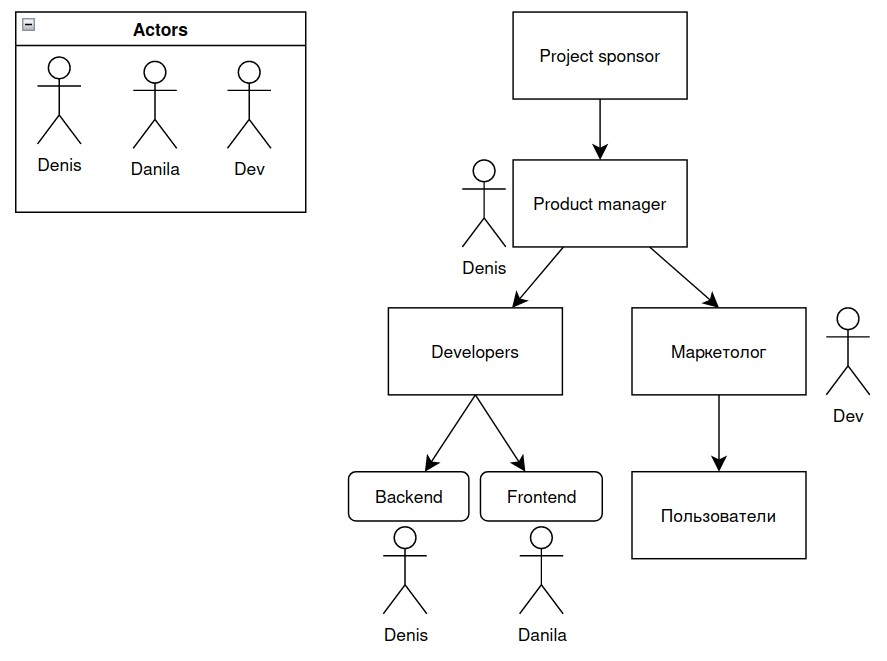
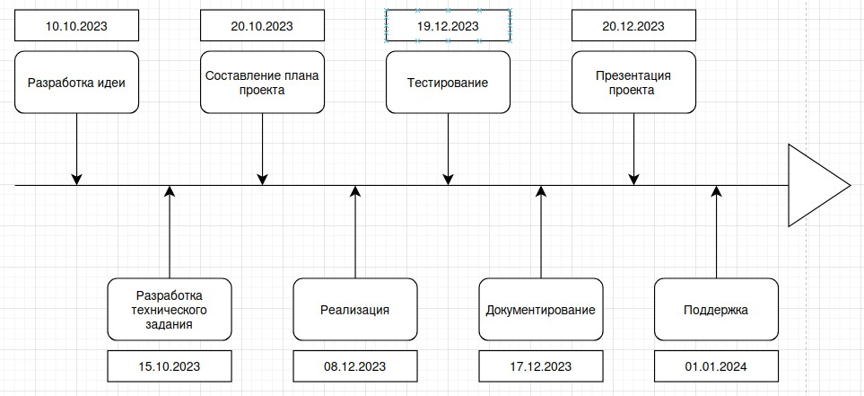

Устав проекта
----

1. Видение проекта
    - Область применения: 
        - Область применения: Просмотр динамики цен на товары.
        - Ограничения: Без возможности полного администрирования сайта. Добавление товаров происходит вручную.
        - Затраты: Временные примерно 4 месяца
        - Задачи: 
            1. Создать дизайн проект сайта
            2. Создать сайт по дизайн проекту
            3. Организовать ежедневный автоматический сбор цен из интернет магазинов
            4. Реализовать возможность входа на сайт
            5. Реализовать возможность добавление/удаления/модификации товара
        - Результаты:
            - Создан сайт в соответствии с дизайн проектом
            - На сайте возможно отслеживание динамики цены товата
            - Администратор может манипулировать товарами
            - Сайт развернут на сервере и доступен через интернет
2. Заинтересованные стороны и клиенты [Из_коммуникационного_плана](Коммуникационный_план.xlsx)
    - Project sponsor
    - Product manager
    - Маркетолог
    - Developers
    - Пользователи
3. Организационная схема

4. Этапы проекта на временной линии (на основе ИСР)

5. План ресурсов

    - Оборудование
        - Сервер, на котором будет развернут сайт
    - ПО
        - VSCode
        - Figma или аналог
        - Postgress
        - Nginx
    - Оборудование
        - 2 ПК
    - Люди
        - 2 чел
6. Бюджет проекта
    1. Аренда сервера: 500 - 1500 руб/мес после прохождения этапа MVP
    2. Регистрация доменного имени: 600 - 1000 руб/мес
    3. Зарплатный фонд
7. Зависимости, ограничения, риски
    - Разработка идеи
        - Субъективное оценивание рынка и конкурентов
    - Разработка технического задания
        - Выбор устаревших технологий
        - Выбор технологий, которые не знает команда разработки
        - Дизайн не уичтывает удобство использования
    - Составление плана проекта
        - Выделение слишком абстрактны задач
        - Неправильное оценивание временных затрат
        - Некорректное создание последовательности из задач
    - Реализация
        - Срыв сроков из-за внешних факторов
    - Тестирование
        - Непольная проверка всех функций сайта
        - Пропуск критических уязвимостей
    - Документирование
        - Искажение функций проекта
        - Отсутствие способов сбора отзывов от пользователей
8. План реализации
        
| Цель                            | Задания                                                                           | Критерий успеха                                                         | Временные рамки       | Ресурсы                      |
| ------------------------------- | --------------------------------------------------------------------------------- | ----------------------------------------------------------------------- | --------------------- | ---------------------------- |
| Разработка идеи                 | Анализ рынка                                                                      | Выявление потребностей пользователей                                    | 01.10.2023-10.10.2023 | Интернет                     |
|                                 | Анализ продуктов конкурентов                                                      | Список конкурентов с их преимуществами и недостатками                   |
|                                 | Создание описания сайта                                                           | Документ содержащий задокументированную идею                            |
| Разработка технического задания | Определение используемых технологий                                               | Список библиотек и сервисов                                             | 11.10.2023-15.10.2023 | Product manager + Developers |
|                                 | Выбор языка и библиотек                                                           | должны быть выбраны конкретные библиотеки и язык программирования       |
|                                 | Разработка макета                                                                 | Создан дизайн сайта в Figme                                             |
|                                 | Выбор хранилища данных                                                            | Список сервисов, где приложение будет хранить данные                    |
|                                 | Утверждение техического задания                                                   | Окончательное решение                                                   |
| Составление плана проекта       | Выделение задач                                                                   | Список задач, разбитых по категориям                                    | 16.10.2023-20.10.2023 | Product manager              |
|                                 | Оценка рисков                                                                     | Выделение для каждой задачи факторов, которые могут помешать её сделать |
|                                 | Создание диаграммы Ганта                                                          | Готовая диаграмма                                                       |
| Реализация                      | Верстка страниц                                                                   | Htm+sass документы                                                      | 20.10.2023-08.12.2023 | Frontend dev                 |
|                                 | Создание функциональной части                                                     | Написанные функции, необходимые для коректогоо функционирования сайта   | Backend dev           |
| Тестирование                    | Создание пользовательских сценариев                                               | Документ с описанием пользовательских сценариев                         | 09.12.2023-19.12.2023 | Тестировщик                  |
|                                 | Проверка созданных сценариев на работоспособность                                 | Проверка пользовательских сценариев на сайте                            |
|                                 | Написание баг-репортов                                                            | Документ с подробным описанием выявленных багов                         |
| Документирование                | Создание общего описания проекта                                                  | Оформление README.md на github                                          | 09.12.2023-17.12.2023 | Product manager + Developers |
|                                 | Создание описания для классов                                                     | Углубление документации                                                 |
| Поддержка                       | Безопасность (выявление уязвимостей)                                           | Документ с выявленными уязвимостями                                     | 21.12.2023-01.01.2024 | Product manager + Developers |
|                                 | Удобство (анализ действий пользователя(изменение дизайна страниц или функций)) | Собранные отзывы от пользователей                                       |
|                                 | Добавление нового функционала                                                     | Переход от MVP к развитию проекта                                       |

[План реализации](Устав_проекта/План_реализации.xlsx)

