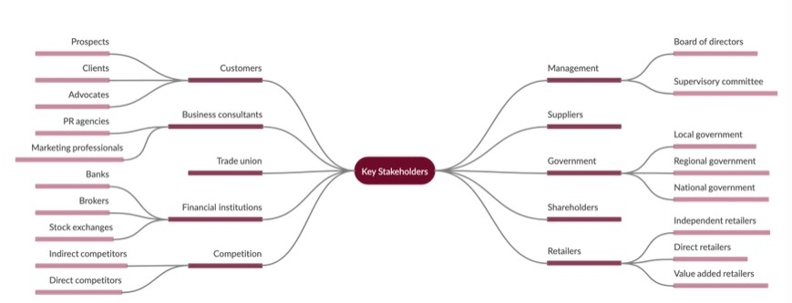
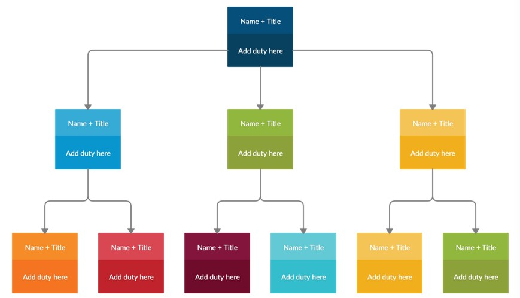
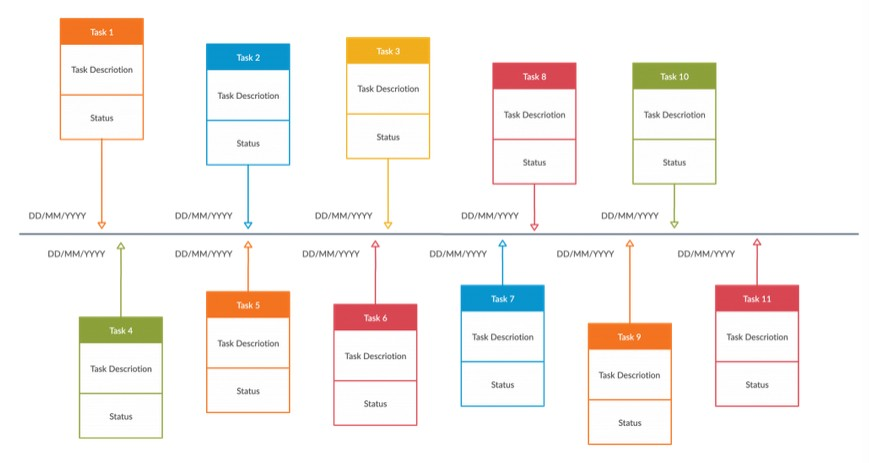
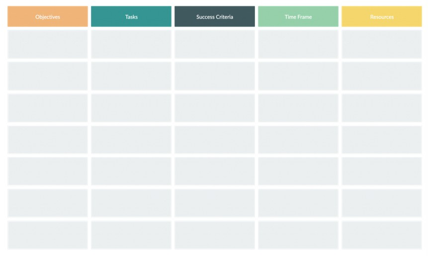

Устав проекта
----

```Устав проекта``` – это документ, в котором излагается видение проекта, его масштаб, цели, команда проекта и их обязанности, основные заинтересованные стороны, а также то, как он будет осуществляться, или план реализации. Он также известен как заявление о проекте и отчет об определении проекта.

Он помогает определить уровень полномочий руководителя проекта и направление проекта.

#### Устав проекта

- Описывает цель и результаты проекта
- Юридически санкционирует начало проекта
- Помогает следить за сроками выполнения проекта
- Помогает выявить ограничения и риски и определить превентивные меры
- Описывает общий обзор бюджета
- Помогает согласовать цели проекта с интересами заинтересованных сторон 


Устав проекта в сравнении с планом проекта

```Устав проекта``` – это инициативный документ высокого уровня, состоящий всего из нескольких страниц. В нем перечисляются цели проекта, объем, видение, команда, их обязанности и заинтересованные стороны.

С другой стороны, ```план проекта``` – это подробный документ, в котором описывается, как достичь целей проекта. В нем указываются результаты проекта, план действий, необходимые ресурсы и этапы.

#### Как разработать устав проекта

Здесь мы рассмотрим, как создать устав проекта и определим его ключевые элементы.

1. Определите видение проекта

    Видение проекта выражается через его конечную цель и назначение. Его можно разделить на,

    **Область применения:** Объясните границы проекта с точки зрения целей проекта, результатов, затрат, сроков и выполняемой работы. Определение объема проекта на ранней стадии жизненного цикла проекта очень важно, так как это повлияет на стоимость проекта и график его выполнения.

    **Задачи:** При постановке целей убедитесь, что они соответствуют критериям SMART, или, другими словами, являются конкретными, измеримыми, достижимыми, реалистичными и своевременными. Принимая во внимание общие цели организации, поставьте около 5 целей, которые должны быть достигнуты к концу проекта.

    **Результаты:** Перечислите результаты, которые будут получены в конце каждого успешного достижения цели.
2. Определите заинтересованные стороны и клиентов

    ```Заинтересованные стороны``` – это лица, которые имеют ключевую долю или интерес в успешном завершении проекта. Они могут быть как внутри компании, так и за ее пределами, и включать тех, кто финансирует ваш проект, а также членов команды и клиентов.

    Вы можете использовать карту заинтересованных сторон, подобную приведенной ниже, чтобы распределить их по категориям и сделать имеющуюся у вас под рукой информацию более презентабельной и легкой для восприятия.

    Карта заинтересованных сторон - Анализ заинтересованных сторон

    

3. Создайте организационную схему

    Теперь, когда вы определили команду проекта, уточните их обязанности.

    Используйте оргсхему, чтобы перечислить их имена, роли и обязанности. В то же время, вы можете подчеркнуть отчетные отношения между членами с помощью соединительных линий.

    Шаблон организационной схемы

    

4. Определите этапы проекта

    Вехи представляют собой важные события в жизненном цикле проекта и включают даты начала и окончания проекта, успешное завершение ключевых результатов и т.д.

    Шаблон расписания проекта

    

5. Создание плана ресурсов

    Перечислите все ресурсы, которые вам понадобятся для проекта: оборудование, машины, люди, материалы и т.д. Это может помочь вам при распределении бюджета.
6. Установите бюджет проекта

    Перечислите расходы, которые ваша организация должна будет понести для реализации плана. Поскольку эти расходы могут меняться в ходе проекта, вы можете сделать приблизительные расчеты. Кроме того, запишите лицо, которое будет отвечать за утверждение расходов.
7. Перечислите зависимости, ограничения и риски

    **Зависимости:** Определите и перечислите зависимости проекта, или виды деятельности, которые окажут влияние на начало или завершение другой задачи.

    **Ограничения:** Выясните факторы, которые будут препятствовать достижению результатов проекта. Например, нехватка ресурсов или времени.

    **Риски:** Риски могут возникнуть на любом этапе жизненного цикла проекта. Важно, чтобы вы заранее определили их и приняли меры предосторожности. Вот несколько отличных приемов управления рисками, которые могут пригодиться здесь.
8. Наметьте план реализации

    Здесь вы составите план действий, выделив основные даты или этапы.

    Шаблон плана действий 

    

#### Визуальный устав проекта

Обычно устав проекта занимает 5-6 страниц. Это одна из основных причин, почему их упускают из виду в процессе управления проектами. Более простой способ написать устав проекта, который все смогут быстро прочитать и понять, приложив минимум усилий, – это визуализация. 


#### Ссылки и материаллы

[Простое руководство по созданию успешного устава проекта](https://creately.com/blog/ru/%D1%83%D0%BF%D1%80%D0%B0%D0%B2%D0%BB%D0%B5%D0%BD%D0%B8%D0%B5-%D0%BF%D1%80%D0%BE%D0%B5%D0%BA%D1%82%D0%BE%D0%BC-2/%D0%BF%D1%80%D0%BE%D1%81%D1%82%D0%BE%D0%B5-%D1%80%D1%83%D0%BA%D0%BE%D0%B2%D0%BE%D0%B4%D1%81%D1%82%D0%B2%D0%BE-%D0%BF%D0%BE-%D1%81%D0%BE%D0%B7%D0%B4%D0%B0%D0%BD%D0%B8%D1%8E-%D1%83%D1%81%D0%BF%D0%B5/)
